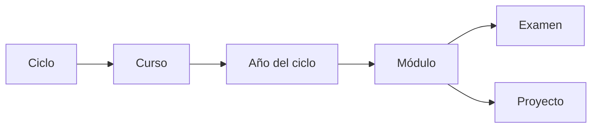

# Proyectos de la Universidad

Hice esto para guardar todo lo relacionado a proyectos/tareas/examenes que haga en la universidad.

**Importante:** La estructura del repositorio es la siguiente:

Este repositorio pensado para 4to ciclo en adelante 🤙

El repositorio anterior ([Proyectos-Universidad](https://github.com/Multex/Proyectos-Universidad)) no lo pienso actualizar más xd. Si necesitas algo de 2do Ciclo o 3er Ciclo puede que encuentres algo ahí (no están todas las tareas).

Si deseas aportar a este proyecto siempre lo puedes hacer con un pull-request o contactándome a mi discord: @ruginit_

## Aviso

No te recomiendo copiar y pegar todo, recuerda que este repositorio es público y puede que alguien más ya haya pensado lo mismo que tú (presentar lo mismo).

El repositorio está hecho para que puedan estudiar lo que realmente se evalúa y puedan tener una mejor idea sobre cómo hacerlo.

Estos cursos no se pasan solos

