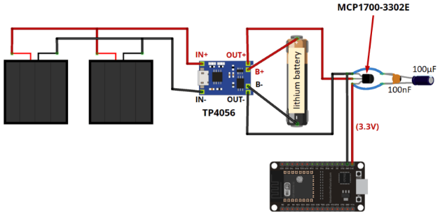
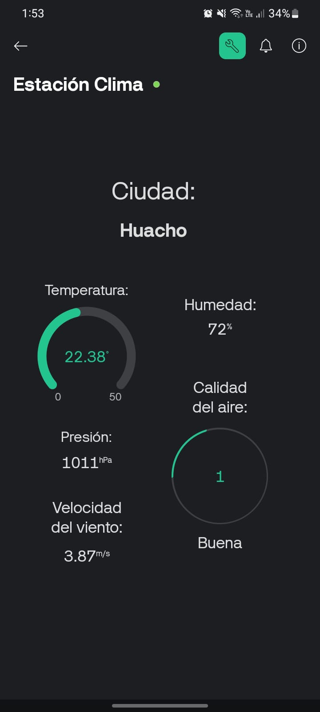

# Estación Meteorológica con Energía Solar

Para este ciclo el ing. Carpio (docente del ciclo 2025-I) nos pidió hacer cualquier proyecto, pero el tema principal es poder adicionar un sistema de carga con energía solar. 

Así que mi proyecto fue algo súper sencillo, usar la API de OpenWeather para conseguir datos meterológicos y mostrarlos en mi celular usando un ESP32. Y para la alimentación del mismo se usaron paneles solares de 5V 1W.

> Si solo te interesa la parte de los datos meteorológicos puedes usar directamente el código de [ESP32-Weather](../Modulo_I/ESP32-Weather/). Recuerda que tienes que cambiar los datos por unos propios.

## Requisitos previos
Usamos PlatformIO para la programación del ESP32.  
Y también usamos las siguientes librerías (también definidas [aquí](ESP32-Weather/platformio.ini)):

```
  WiFi
  HTTPClient
  blynkkk/Blynk @ ^1.1.0
  bblanchon/ArduinoJson @ ^6.21.2
```

## Software y Materiales
El código para el ESP32 fue hecho usando platformio y lo encuentras [aquí](../Modulo_I/ESP32-Weather/).

|  Unidad  |   Elemento   |  Referencia |
|:--------:|:------------:|:------:|
| 01 | ESP32 | [ESP32 DEVKIT V1 Pinout](https://mischianti.org/wp-content/uploads/2021/03/ESP32-DOIT-DEV-KIT-v1-pinout-mischianti-1024x501.jpg) |
| 02 | Paneles Solares | 5V, 1W |
| 01 | Batería Recargable | 3.7V, 1200mAh |
| 01 | TP4056 | [Módulo de carga](https://www.az-delivery.de/cdn/shop/products/tp4056-micro-usb-5v-1a-laderegler-lithium-li-ion-batterie-charger-modul-265554.jpg?v=1679399280) |
| 01 | LM2596 | [Módulo regulador de voltaje](https://hifisac.com/web/image/product.template/1718/image_1024?unique=37ad4e6) |

## Esquema de conexión
La verdad es que el esquema es un poco distinto, pero se pueden guiar de este. El único cambio sería el MCP1700 y los capacitores por su modulo LM2596, conectado directamente al ESP32.



## Código

### 1. Configuración inicial

El programa inicia incluyendo las librerías necesarias para manejar:

- Conexiones WiFi.
- Comunicaciones con Blynk.
- Peticiones HTTP.
- Interpretación de archivos JSON.

Se definen los siguientes datos:

- SSID y contraseña de la red WiFi.
- Credenciales de Blynk (`BLYNK_TEMPLATE_ID`, `BLYNK_TEMPLATE_NAME`, `BLYNK_AUTH_TOKEN`).
- API Key de OpenWeatherMap y la ciudad de consulta (`"Huacho,PE"`).

---

### 2. Conexión y primera solicitud

En la función `setup()`:

```cpp
void setup() {
  Serial.begin(115200);
  WiFi.begin(ssid, password);
  Blynk.begin(auth, ssid, password);
  hacerPeticionClima();
}
```

- Se establece la comunicación serial a 115200 baudios.
- Se conecta el ESP32 a la red WiFi y a la plataforma Blynk.
- Se realiza una primera petición a OpenWeather para obtener el clima actual.

---

### 3. Peticiones periódicas

Dentro de la función `loop()`:

```cpp
void loop() {
  Blynk.run();
  if (millis() - tiempoUltimaPeticion > 600000) { // cada 10 minutos
    hacerPeticionClima();
    tiempoUltimaPeticion = millis();
  }
}
```

- Se ejecuta `Blynk.run()` para mantener la conexión con la app.
- Cada 10 minutos (600,000 ms), se llama a la función `hacerPeticionClima()`.

---

### 4. Descripción de `hacerPeticionClima()`

Esta función realiza dos peticiones HTTP:

#### a) Consulta del clima actual

Se hace una solicitud HTTP GET a:

```
http://api.openweathermap.org/data/2.5/weather?q=Huacho,PE&appid=API_KEY&units=metric
```

Se obtienen y procesan los siguientes datos:

- Ciudad (`name`)
- Temperatura (`main.temp`) en °C
- Humedad (`main.humidity`) en %
- Velocidad del viento (`wind.speed`) en m/s
- Presión atmosférica (`main.pressure`) en hPa
- Coordenadas (`coord.lat`, `coord.lon`)

Estos valores se envían a los pines virtuales de Blynk:

| Dato                | Pin virtual Blynk |
|---------------------|:-----------------:|
| Temperatura         | V0                |
| Ciudad              | V1                |
| Humedad             | V2                |
| Presión             | V3                |
| Velocidad del viento| V4                |

También se imprimen en el monitor serial.

#### b) Consulta de calidad del aire

Con las coordenadas recibidas (`lat`, `lon`), se hace otra solicitud HTTP a:

```
http://api.openweathermap.org/data/2.5/air_pollution?lat=LAT&lon=LON&appid=API_KEY
```

Se extrae el valor del AQI (`list[0].main.aqi`), que es interpretado como:

| Valor AQI | Calidad del aire |
|:---------:|:----------------:|
| 1         | Buena            |
| 2         | Aceptable        |
| 3         | Moderada         |
| 4         | Mala             |
| 5         | Muy Mala         |

Estos datos también son enviados a Blynk:

| Dato                  | Pin virtual Blynk |
|-----------------------|:-----------------:|
| Índice de calidad aire| V4                |
| Texto descriptivo     | V6                |

Finalmente, se cierra la conexión HTTP para liberar recursos.

## Resultados

Durante el funcionamiento del sistema, se obtuvo la siguiente información en la
aplicación Blynk y en el monitor serial:

```
--------------------------------------
--- Datos del Clima Actual ---
Ciudad: Huacho
Temperatura: 22.5 °C
Humedad: 80 %
Viento: 3.6 m/s
Presión: 1012 hPa
Calidad del aire (AQI): 2 - Aceptable
--------------------------------------
```

Cada 10 minutos, los valores se actualizan automáticamente en tiempo real.
La app de Blynk mostró los datos de manera clara en los diferentes widgets
configurados para cada pin virtual.

